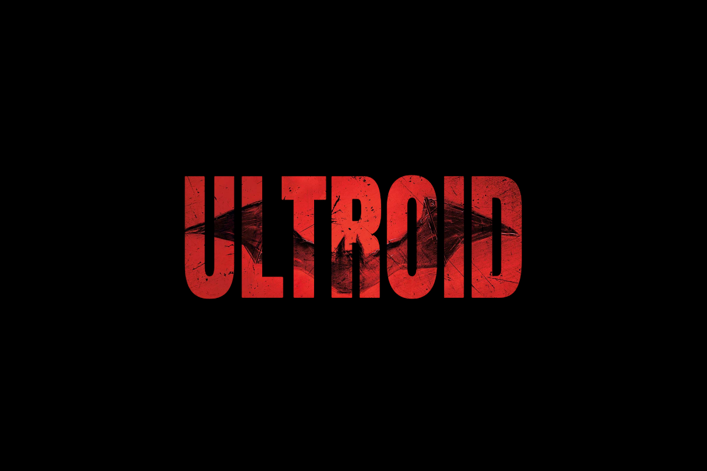

# Auto-Ultroid
> Auto-Script For Ultroid Userbot Deployment 🖤

<p align="center">
  
</p>
<h1 align="center">

## Heroku Installation 

* ``` You Can Easily Deploy Ultroid Without Any Violation Issue ``` 

  [](https://deploy.ultroid.tech)

## Local Installation 

```
wget https://raw.githubusercontent.com/ImDarkLK/Auto-Ultroid/main/Ultroid.sh -O && bash ./Ultroid.sh
``` 

* Edit Config ``` nano .env ``` <br>
(Fill <b> .env </b> Config With Your Values)

* Save Config ``` Ctrl X + Y ``` <br>
(Press <b> Enter </b> After Y To Save)

* Start Userbot <br>
Method 1 : ``` python3 -m pyUltroid ``` <br>
Method 2 : ``` bash startup ``` <br>
(You Can Use <b> Any Method </b> To Start)

## String Session 

* Generate Via Terminal <br> ``` bash resources/session/session.sh ``` 
* Generate Via Replit <br> [](https://replit.com/@TeamUltroid/UltroidStringSession)
* Generate Via Telegram Bot <br> [@SessionGeneratorBot](https://t.me/SessionGeneratorBot)

<b> © Copyrights @ TeamUltroid </b>

## README Redirect

* [Click Here](https://github.com/TeamUltroid/Ultroid/blob/main/README.md#Necessary-Variables) ~ Necessary Variables <br>
* [Click Here](https://github.com/TeamUltroid/Ultroid/blob/main/README.md#documentation) ~ Documentation <br>
* [Click Here](https://github.com/TeamUltroid/Ultroid/blob/main/README.md#tutorial) ~ Tutorials
* [Click Here](https://github.com/TeamUltroid/Ultroid/blob/main/README.md#deploy-locally) ~ Deployment Methods <br>
* [Click Here](https://github.com/TeamUltroid/Ultroid/blob/main/README.md#license) ~ License


## Full Credits

* [Ultroid](https://github.com/TeamUltroid/Ultroid/blob/main/README.md#credits) Userbot
* [Dark](https://github.com/ImDarkLK) Nothing

## Enjoy !!!
